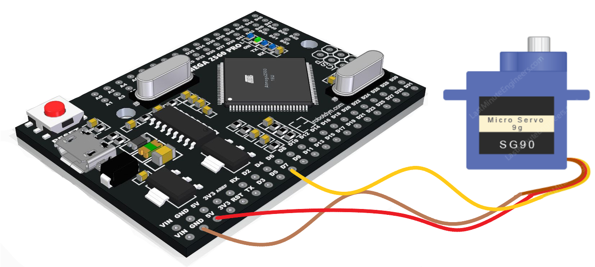

# Servo_Rc_PWM
This library is Servo library and uses Arduino Mega Timer functions.

Example Code

```C++
#include <Servo_Rc_PWM.h>

Servo myservo;  // create servo object to control a servo
// twelve servo objects can be created on most boards

int pos = 0;    // variable to store the servo position

void setup() {
  myservo.attach(7);  // attaches the servo on pin 7 to the servo object
}

void loop() {
  for (pos = 0; pos <= 180; pos += 1) { // goes from 0 degrees to 180 degrees
    // in steps of 1 degree
    myservo.write(pos);              // tell servo to go to position in variable 'pos'
    delay(15);                       // waits 15ms for the servo to reach the position
  }
  for (pos = 180; pos >= 0; pos -= 1) { // goes from 180 degrees to 0 degrees
    myservo.write(pos);              // tell servo to go to position in variable 'pos'
    delay(15);                       // waits 15ms for the servo to reach the position
  }
}
```




